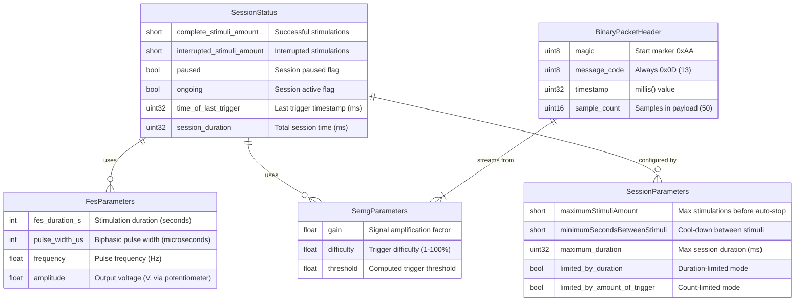
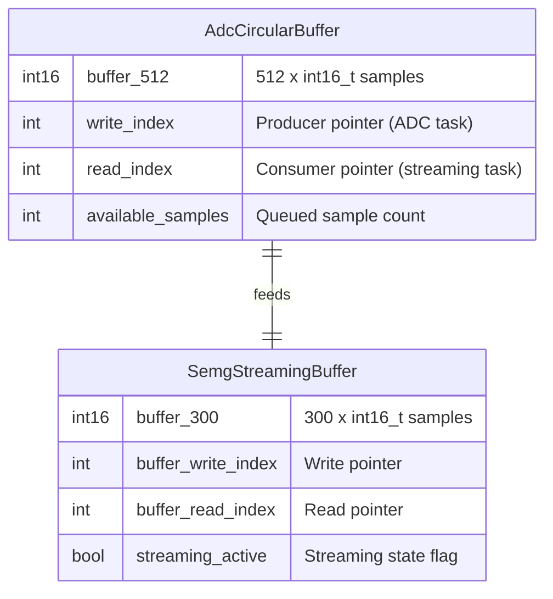

# Data Structures

> Auto-generated by repo-map. Last updated: 2026-02-17.

This project is an embedded firmware (ESP32) with no persistent database. Data structures exist only in RAM as C++ structs. This document maps the runtime data model.

---

## Runtime Data Model

---

## Circular Buffer Architecture

