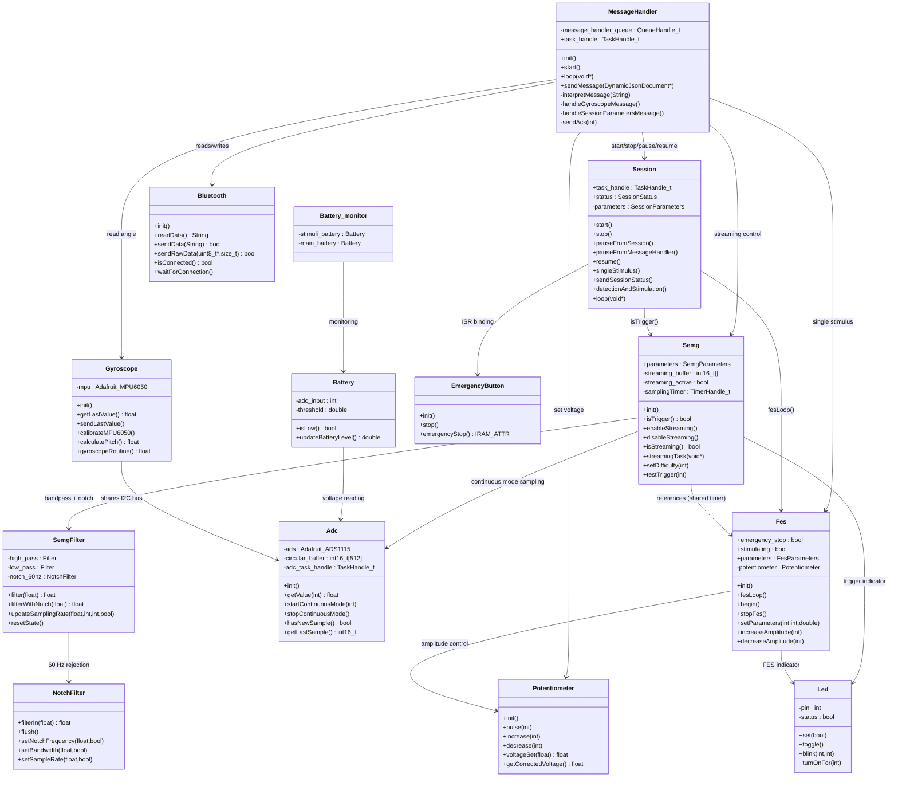
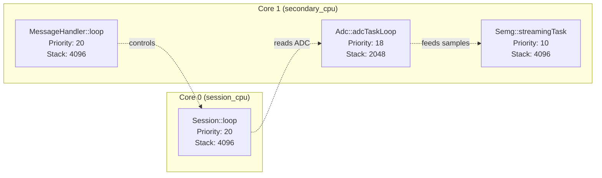
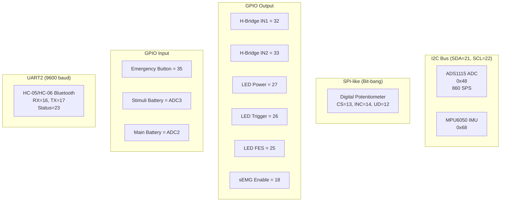

# Class / Module Diagram

> Auto-generated by repo-map. Last updated: 2026-02-17.

All classes use the **static singleton pattern** (deleted constructors) except `Led`, `Battery`, `NotchFilter`, and `Potentiometer`.

---

## Module Dependency Map

---

## FreeRTOS Task Map

---

## Hardware Peripheral Map

