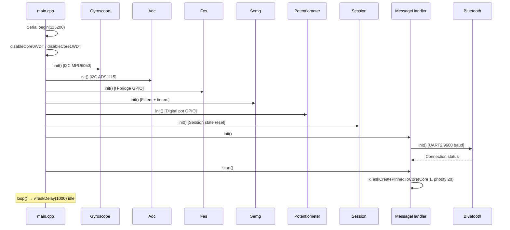
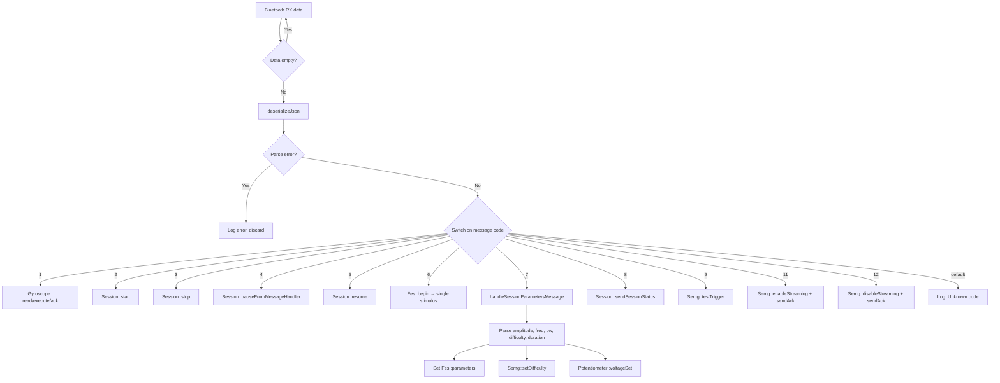
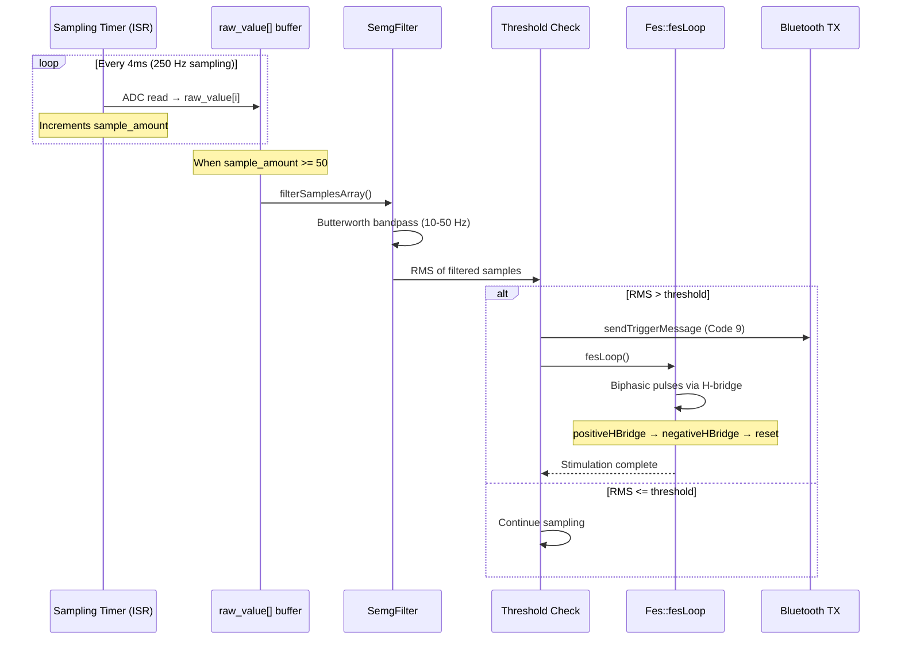
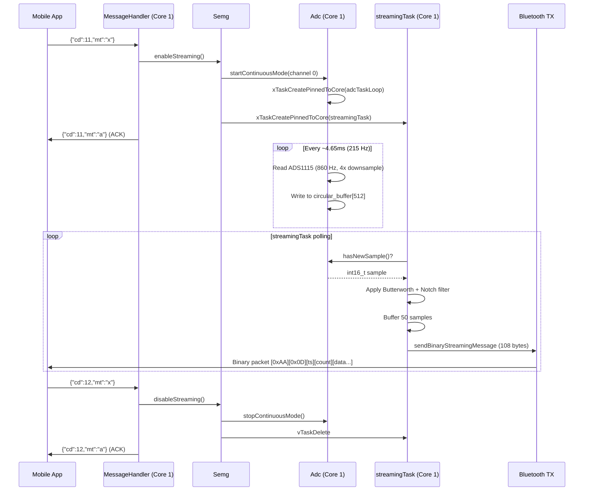
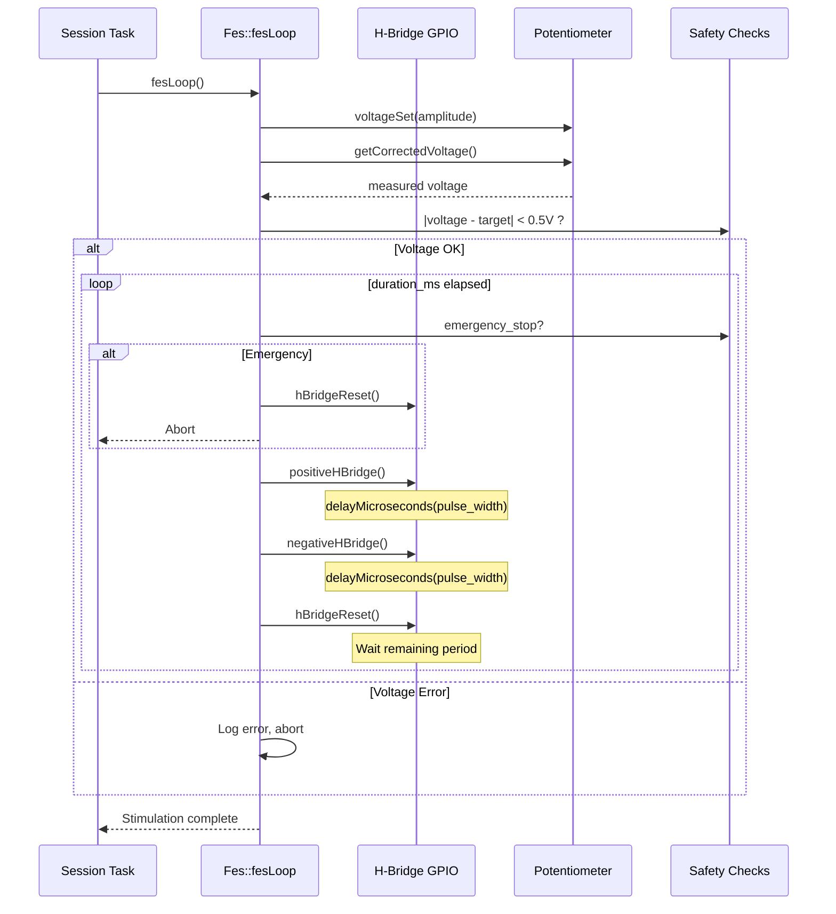
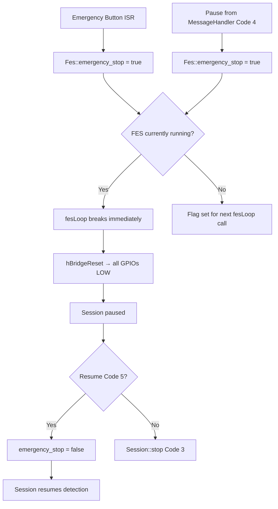
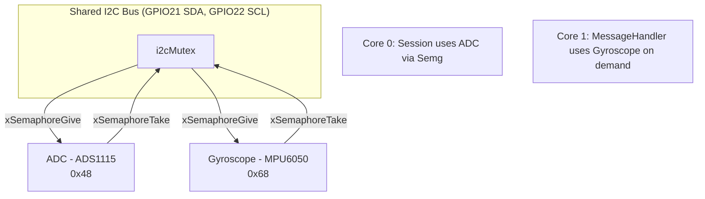

# System Workflows

> Auto-generated by repo-map. Last updated: 2026-02-17.

---

## 1. Firmware Boot Sequence



---

## 2. Command Processing Flow



---

## 3. FES Session Lifecycle

```mermaid
stateDiagram-v2
    [*] --> Idle
    Idle --> Ongoing: Session::start() [Code 2]

    state Ongoing {
        [*] --> Detecting
        Detecting --> Stimulating: Semg::isTrigger() == true
        Stimulating --> Paused_Internal: Fes complete → delayBetweenStimuli
        Paused_Internal --> Detecting: Delay elapsed
    }

    Ongoing --> Paused_External: Code 4 / EmergencyButton
    Paused_External --> Ongoing: Session::resume() [Code 5]
    Ongoing --> Idle: Session::stop() [Code 3]
    Paused_External --> Idle: Session::stop() [Code 3]
```

---

## 4. sEMG Trigger Detection Pipeline



---

## 5. 215 Hz Streaming Flow



---

## 6. FES Biphasic Pulse Generation



---

## 7. Emergency Stop Flow



---

## 8. I2C Bus Sharing


